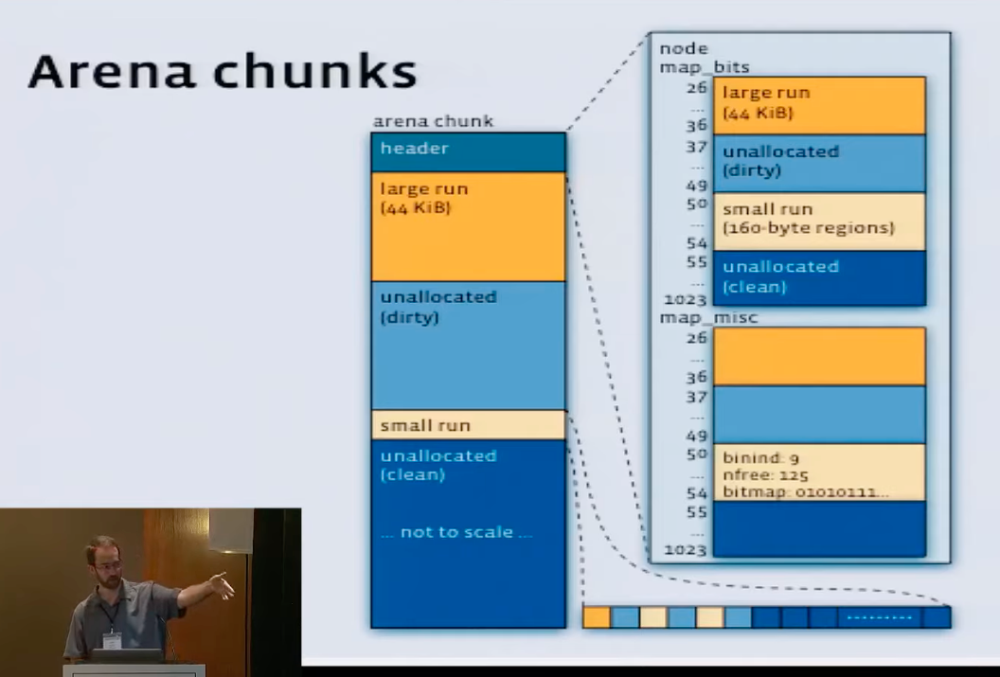

quick link:
- https://github.com/jemalloc/jemalloc/wiki
- https://engineering.fb.com/2011/01/03/core-data/scalable-memory-allocation-using-jemalloc/

notes：

- not good for very small embedded systems on footprint

application:
[Optimizing memory consumption with tcmalloc or jemalloc - IBM Documentation](https://www.ibm.com/docs/en/spectrum-symphony/7.3.0?topic=optimization-optimizing-memory-consumption-tcmalloc-jemalloc)

