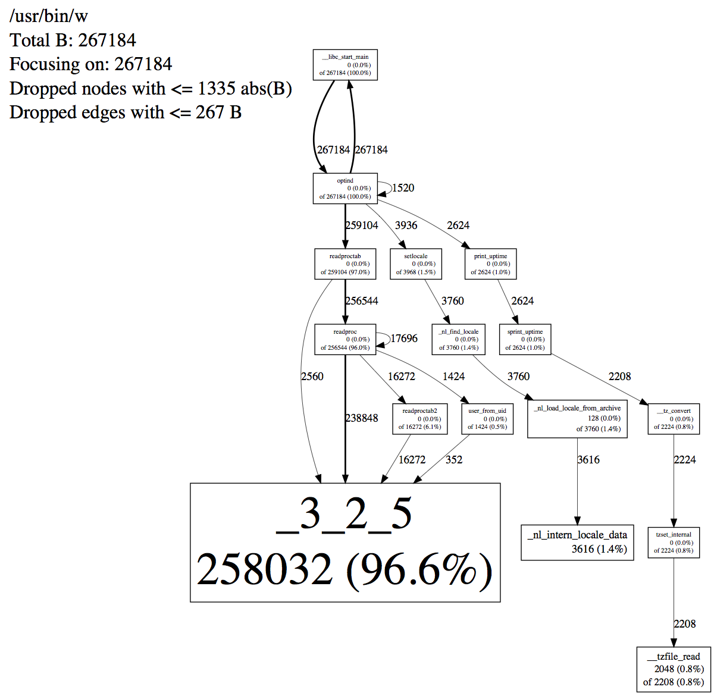

How does one go about finding a memory leak in a production application?  For that matter, what if there is no leak, but the application is exhausting memory for non-apparent reasons?  Heap profiling can help.

jemalloc's heap profile output files are compatible with those created by [gperftools](https://code.google.com/p/gperftools/), so the [gperftools heap profiler documentation](http://gperftools.googlecode.com/svn/trunk/doc/heapprofile.html) is relevant reading.  You will need the `pprof` Perl script that is part of the [gperftools](https://code.google.com/p/gperftools/) distribution.  Use the `pprof` that is included with jemalloc.

Let's start off with the simple case, where it is possible to shut the application down and see what memory was still allocated at exit.  The offending application we will look at is `w`:

    MALLOC_CONF=prof_leak:true,lg_prof_sample:0 LD_PRELOAD=${JEMALLOC_PATH}/lib/libjemalloc.so.1 w

This will result in something like the following output when the program exits:

    <jemalloc>: Leak summary: 267184 bytes, 473 objects, 20 contexts
    <jemalloc>: Run pprof on "jeprof.19678.0.f.heap" for leak detail

To learn more about the leaks, run:

    pprof --show_bytes `which w` jeprof.19678.0.f.heap
        Using local file /usr/bin/w.
    Using local file jeprof.19678.0.f.heap.
    Welcome to pprof!  For help, type 'help'.
    (pprof) top
    Total: 267184 B
      258032  96.6%  96.6%   258032  96.6% _3_2_5
        3616   1.4%  97.9%     3616   1.4% _nl_intern_locale_data
        2048   0.8%  98.7%     2208   0.8% __tzfile_read
        1024   0.4%  99.1%     1024   0.4% getpwnam
        1024   0.4%  99.5%     1072   0.4% getpwuid
         448   0.2%  99.6%      448   0.2% __gconv_lookup_cache
         384   0.1%  99.8%      384   0.1% getutent
         224   0.1%  99.9%      224   0.1% strdup
         160   0.1%  99.9%      160   0.1% __tzstring
         128   0.0% 100.0%     3760   1.4% _nl_load_locale_from_archive
          48   0.0% 100.0%       48   0.0% get_mapping

To generate a PDF of the call graph for where the leaks occurred, run:

    pprof --show_bytes --pdf `which w` jeprof.19678.0.f.heap > w.pdf

Here is the result: 